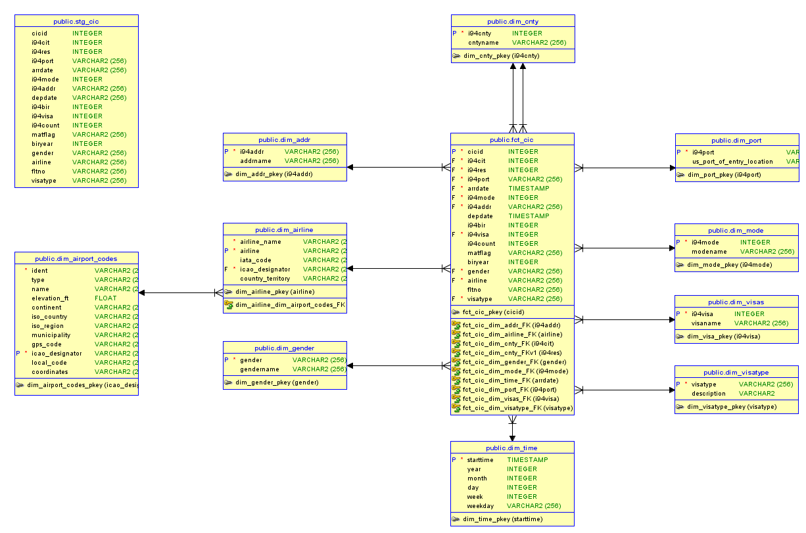
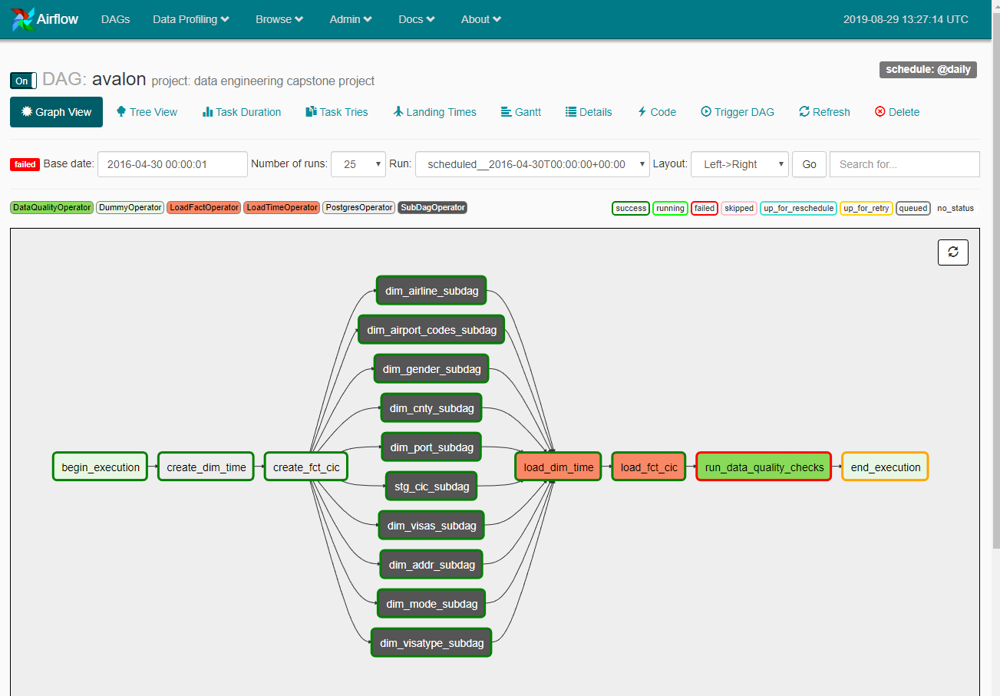
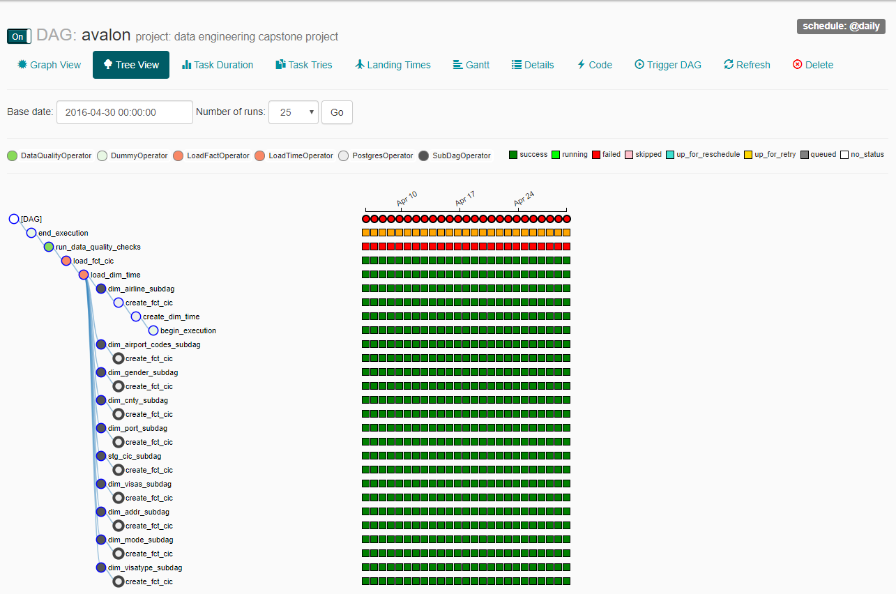
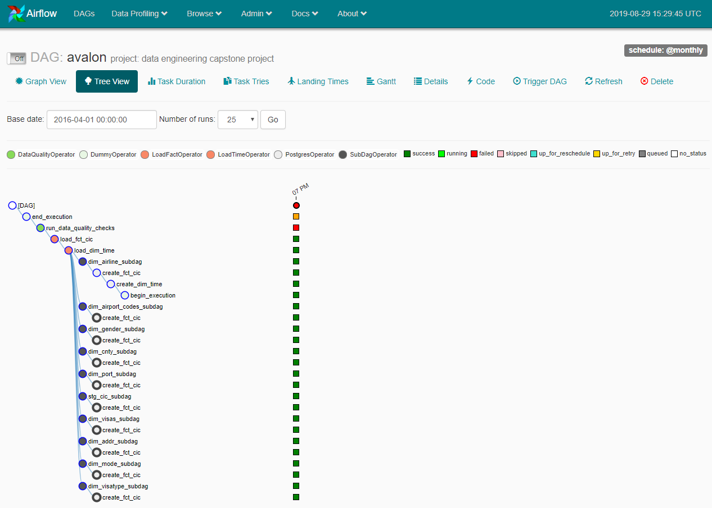

# Airflow DAG: avalon project: data engineering capstone project
## Write Up

### Outline of the steps taken
## Step 1: Scope the Project and Gather Data - I chose the `Udacity Provided Project`. The `Udacity Provided Project` is a project that contains Form I-94 data that was collected for the Census Information Center.

`Form I-94`
From Wikipedia, the free encyclopedia
Jump to navigationJump to search

**Form I-94**, the **Arrival-Departure Record Card**, is a form used by U.S. Customs and Border Protection (CBP) intended to keep track of the arrival and departure to/from the United States of people who are not United States citizens or lawful permanent residents (with the exception of those who are entering using the Visa Waiver Program or Compact of Free Association, using Border Crossing Cards, re-entering via automatic visa revalidation, or entering temporarily as crew members).[1] While the form is usually issued by CBP at ports of entry or deferred inspection sites, USCIS can issue an equivalent as part of the Form I-797A approval notice for a Form I-129 petition for an alien worker or a Form I-539 application for extension of stay or change of status (in the case that the alien is already in the United States).[2][3]

`Census Information Center`
From Wikipedia, the free encyclopedia
Jump to navigationJump to search

The **Census Information Center** program is part of the U.S. Census Bureau's data dissemination network.

#### Udacity Provided Project

In the Udacity provided project, I worked with multiple datasets to complete the project. 
* `immigration_data_sample.csv` - The main dataset includes data on immigration to the United States. As the name implies this dataset was just a sample. It was used to determine if the columns were dimensional or factual in nature.
* `sas_data` folder - The folder contains 15 items of which 14 are PARQUET files. I used the first PARQUET file as my initial dataset for initial development - it contains 219,268 records. For the final test I used all 14 PARQUET files. 14 PARQUET files equates to 3,096,313 records.
* `airport-codes_csv.csv` - https://datahub.io/core/airport-codes#python
* `US_Customs_and_Border_Protection_Port_of_Entry_Codes.tsv` - https://redbus2us.com/travel/usa/us-customs-and-border-protection-cbp-codes-port-of-entry-stamp/
* `ISO_3166-1.csv` - https://en.wikipedia.org/wiki/ISO_3166-1 Current Country codes and names.
* `I94_SAS_Labels_Descriptions.SAS` - this file contains column label descriptions and list of values based on the data contained within the immigration_data_sample.csv. The list of values in certain instances were used for populating the applicable dimension.
* `Current_Airline_Members.tsv` - https://www.iata.org/about/members/Pages/airline-list.aspx?All=true
* `Classes_of_visas.tsv` - https://en.m.wikipedia.org/wiki/Visa_policy_of_the_United_States#Classes_of_visas

### End Use Cases
The data contains a fact/measure of passenger counts which is a good candidate for a business intelligence dimensional model. The data is well suited to answer questions such as: How many passengers have arrived in the country but have not left yet? How busy are the ports of entry for a given day? How long has a passenger stayed in the USA?

## Step 2: Explore and Assess the Data

* Explore the data to identify data quality issues, like missing values, duplicate data, etc.
* Document steps necessary to clean the data

### I created applicable csv and tsv files which where then processed via jupyter to write an applicable json file

    I used jupyter to read the applicable csv and tsv files and then have them written to a json format. This was done because all of the json files are used as input to Amazon Web Services (AWS) S3. I wrote a jupyter notebook for each csv/tsv and sas_data files to be processed.

|jupyter|reads|writes|
|-------|-----|------|
|i94addr_spark.ipynb|i94addr.csv|dim_addr
|i94airline_spark.ipynb|Current_Airline_Members.tsv|dim_airline
|i94cnty_spark.ipynb|i94cnty.csv, ISO_3166-1.tsv|dim_cnty
|i94gender_spark.ipynb|i94gender.csv|dim_gender
|i94mode_spark.ipynb|i94mode.csv|dim_mode
|i94port_spark.ipynb|US_Customs_and_Border_Protection_Port_of_Entry_Codes.tsv|dim_port
|i94visas_spark.ipynb|i94visas|dim_visas
|i94visatype_spark.ipynb|Classes_of_visas.tsv|dim_visatype
|i94_airport_codes_csv.ipynb|airport-codes_csv.csv|dim_airport_codes
|i94_read_sas_data_part-00000_write_json_data_part-00000.ipynb|sas_data_part-00000|json_data_part-00000/stg_cic
|i94_read_sas_data_write_json_data.ipynb|sas_data|json_data/stg_cic

### I created an AWS bucket to store all source files that were used in the capstone project

I created a bucket called solarhenge. Under the solarhenge bucket I created individual dim and stg folders. 
|s3_prefix|s3_bucket|s3_key|
|---------|---------|------|
|s3:/|solarhenge|dim_addr|
|s3:/|solarhenge|dim_airline|
|s3:/|solarhenge|dim_airport_codes|
|s3:/|solarhenge|dim_cnty|
|s3:/|solarhenge|dim_gender|
|s3:/|solarhenge|dim_mode|
|s3:/|solarhenge|dim_port|
|s3:/|solarhenge|dim_visas|
|s3:/|solarhenge|dim_visatype|
|s3:/|solarhenge|stg_cic|

Some data cleansing 

|jupyter notebook|comment|code|
|----------------|-------|----|
|i94airline_spark|# drop all rows where a column contains a null value|tsv_i94airline = tsv_i94airline.dropna()
|i94_airport_codes_csv|# drop all rows where a column contains a null value|csv_airport_codes = csv_airport_codes.dropna()|
|i94_read_sas_data_write_json_data.ipynb|# drop columns that CIC does not use|sp_df = sp_df.drop("dtadfile","visapost","occup","entdepa","entdepd","entdepu","dtaddto")
|||sp_df = sp_df.drop("i94yr","i94mon","insnum","admnum")
||# rename reserved count column name to something else|sp_df = sp_df.withColumnRenamed("count", "i94count")
||# create a spark dataframe where the depdate is not null|sp_depdate_nn = sp_df.where(F.col("depdate").isNotNull())
||# convert the 5 digit arrdate/sasdate to a yyyymmdd format|sp_depdate_nn = sp_depdate_nn.withColumn('arrdate', convert_5_digit_sasdate_to_yyyymmdd_udf(F.col('arrdate')))
||# convert the 5 digit depdate/sasdate to a yyyymmdd format|sp_depdate_nn = sp_depdate_nn.withColumn('depdate', convert_5_digit_sasdate_to_yyyymmdd_udf(F.col('depdate')))
||# create a spark dataframe where the depdate is null|sp_depdate_n = sp_df.where(F.col('depdate').isNull())
||# convert the 5 digit arrdate/sasdate to a yyyymmdd format|sp_depdate_n = sp_depdate_n.withColumn('arrdate', convert_5_digit_sasdate_to_yyyymmdd_udf(F.col('arrdate')))
||# join the not null and null depdate spark dataframes into one|sp_stg_cic = sp_depdate_nn.union(sp_depdate_n)
|i94cnty_spark|# this notebook combines 2 csv files|sp_dim_cnty = sp_iso_3166.union(sp_i94cnty)
||# drop duplicates|sp_dim_cnty = sp_dim_cnty.dropDuplicates(subset=['I94CNTY'])

## Step 3: Define the Data Model
* Identify the dimensions and facts - Using the `immigration_data_sample.csv` and `I94_SAS_Labels_Descriptions.SAS` I came up with the following tables:

|TABLE_NAME|DESCRIPTION|
|----------|-----------|
|stg_cic|Stage CIC - basically the same structure as the `immigration_data_sample.csv`. This table will be the staging table where data will be copied from the sas_data/json_data folder to this table.|
|dim_addr|Address Dimension - US State Codes|
|dim_airline|Airline Dimension - airline that the passenger travelled on|
|dim_airport_codes|Airport Codes Dimension - this dimension is a snowflake dimension related to the airline dimension. It contains latitude and longitude coordinates that could be used to visualize this data on a map.|
|dim_gender|Gender Dimension - lists the 3 types of gender|
|dim_port|Port of Entry Dimension - lists the port of entry code and the port of entry location|
|dim_mode|Mode Dimension - How did the passenger arrive into the United States? 1. Air, 2. Sea, 3. Land or 9. Not Reported.|
|dim_visas|Visa Dimension - 1. Business, 2. Pleasure or 3. Student|
|dim_visatype|Visa Type Dimension - Classes of Visas|
|fct_cic|CIC/I94 Fact - similar structure to the staging table except for the arrdate and depdate data types.|

* The steps necessary to pipeline the data into this data model is as follows:
  * create csv and tsv files for the dimensions
    * create jupyter python notebooks to read the csv/tsv files into a apache spark dataframe
    * clean up any data related issues in the apache spark dataframe
    * write the apache spark dataframe to an applicable folder to contain the json file
  * download the sas_data folder and content from Udacity Workspace to my local computer
    * create a jupyter python notebook to read the first PARQUET file in the sas_data folder and do some data wrangling and then write to an applicable folder to contain the json file
    * create a jupyter python notebook to read all of the PARQUET files in the sas_data folder and do some data wrangling and then write to an applicable folder to contain the json file
  * create a aws s3 bucket and applicable dimension and stage folders that will contain the json files
    * upload all local json files to applicable s3 bucket folders
  * create airflow dags, subdags, helpers and operators that will be used for the etl pipeline

## Step 4: Run ETL to Model the Data

* Create the etl pipeline and the data model
  * The business intelligence dimensional data model is as follows: 

  * The data dictionary can be found at [All Tables Details 5](./AllTablesDetails_5_index.html)

  * The data pipeline tool that I have chosen to use is Apache Airflow. Here is the Airflow Graph View... 

  * Data quality checks results... I basically had 2 different jobs...
    1. One PARQUET file to test a schedule of daily with 219,268 rows of data
    2. All PARQUET files to test the processing of 3 million rows of data
    
       Once I got everything working with One PARQUET file then I was confident to run ALL PARQUET files.

       Note: I did not enforce referential integrity foreign key constraints on the fact table for I wanted to ensure that the data quality checks ran as expected. The adding of foreign keys to the fact table is to be done in another project or lifetime.

One PARQUET file results... 
Here is a snippet of the run_data_quality_checks log...
```
*** Reading local file: /home/jordan/airflow/logs/avalon/run_data_quality_checks/2016-04-01T00:00:00+00:00/2.log

*** one partition

[2019-08-28 21:14:53,937] {logging_mixin.py:95} INFO - [2019-08-28 21:14:53,937] {data_quality.py:60} INFO - SUCCESS - Data quality check passed. fct_cic contains 219268 records
[2019-08-28 21:14:53,937] {logging_mixin.py:95} INFO - [2019-08-28 21:14:53,937] {data_quality.py:65} INFO - ERROR - Data quality check failed. select count(distinct a.i94addr) from fct_cic a left outer join dim_addr b on a.i94addr = b.i94addr where 1 = 1 and b.i94addr is null returned 112 rows
[2019-08-28 21:14:53,938] {logging_mixin.py:95} INFO - [2019-08-28 21:14:53,937] {data_quality.py:65} INFO - ERROR - Data quality check failed. select count(distinct a.airline) from fct_cic a left outer join dim_airline b on a.airline = b.airline where 1 = 1 and b.airline is null returned 116 rows
[2019-08-28 21:14:53,938] {logging_mixin.py:95} INFO - [2019-08-28 21:14:53,938] {data_quality.py:65} INFO - ERROR - Data quality check failed. select count(distinct a.i94cit) from fct_cic a left outer join dim_cnty b on a.i94cit = b.i94cnty where 1 = 1 and b.i94cnty is null returned 11 rows
[2019-08-28 21:14:53,938] {logging_mixin.py:95} INFO - [2019-08-28 21:14:53,938] {data_quality.py:65} INFO - ERROR - Data quality check failed. select count(distinct a.i94port) from fct_cic a left outer join dim_port b on a.i94port = b.i94port where 1 = 1 and b.i94port is null returned 31 rows
[2019-08-28 21:14:53,938] {taskinstance.py:1047} ERROR - Data quality check failed.
```  

One partition was processed and the fct_cic table was populated with 219268 records which is what was expected.
A series of queries were executed to determine if data was missing on predetermined dimension tables
For instance, the fact table had 112 distinct addresses that did not exist on the address dimension table. Additional investigation and cleanup would need to be done. Same goes for the countries and ports of entry and all other fact attributes that require a foreign key relationship to the applicable dimension.
Next Steps are to resolve the missing dimensional data by adding the missing data and running again and if the run is error free then the foreign key can be added to the fact table etc.

All PARQUET files results... 
Here is a snippet of the run_data_quality_checks log...
```
*** Reading local file: /home/jordan/airflow/logs/avalon/run_data_quality_checks/2016-04-01T00:00:00+00:00/2.log

*** all partitions

[2019-08-29 10:17:04,413] {logging_mixin.py:95} INFO - [2019-08-29 10:17:04,412] {data_quality.py:60} INFO - SUCCESS - Data quality check passed. fct_cic contains 3096313 records
[2019-08-29 10:17:04,413] {logging_mixin.py:95} INFO - [2019-08-29 10:17:04,413] {data_quality.py:65} INFO - ERROR - Data quality check failed. select count(distinct a.i94addr) from fct_cic a left outer join dim_addr b on a.i94addr = b.i94addr where 1 = 1 and b.i94addr is null returned 402 rows
[2019-08-29 10:17:04,413] {logging_mixin.py:95} INFO - [2019-08-29 10:17:04,413] {data_quality.py:65} INFO - ERROR - Data quality check failed. select count(distinct a.airline) from fct_cic a left outer join dim_airline b on a.airline = b.airline where 1 = 1 and b.airline is null returned 402 rows
[2019-08-29 10:17:04,413] {logging_mixin.py:95} INFO - [2019-08-29 10:17:04,413] {data_quality.py:65} INFO - ERROR - Data quality check failed. select count(distinct a.i94cit) from fct_cic a left outer join dim_cnty b on a.i94cit = b.i94cnty where 1 = 1 and b.i94cnty is null returned 20 rows
[2019-08-29 10:17:04,413] {logging_mixin.py:95} INFO - [2019-08-29 10:17:04,413] {data_quality.py:65} INFO - ERROR - Data quality check failed. select count(distinct a.i94port) from fct_cic a left outer join dim_port b on a.i94port = b.i94port where 1 = 1 and b.i94port is null returned 69 rows
[2019-08-29 10:17:04,413] {taskinstance.py:1047} ERROR - Data quality check failed.
```
All partitions were processed and the fct_cic table was populated with 3096313 records which is what was expected.

## Step 5: Final Thoughts

* What was the goal? The goal was to utilize all of the tools and knowledge that I gained while attending this program. Tools that were used were: AWS S3, AWS Redshift, PostgreSQL, Apache Spark, Apache Airflow, jupyter and we must not forget Python. I believe that I have achieved this goal.  

* What questions did I want answered? Since the dataset was to do with airline passengers immigrating to the United States, there are numerous questions that can be asked...
Just a few are:
  * Q1. How busy are the ports of entry?
  * Q2. Where are the passengers coming from and how many and what port of entry are they arriving at and what is the purpose of their visit?
  * Q3. there are a multitude of other questions...

Here is a generic query to use as a model going forward...
```
-- big_kahuna query
-- q: how many airline passengers arrived and where and when
-- where = port of entry
-- when = arrdate aka arrival date

select
f.arrdate
,f.depdate
--,f.cicid
,f.i94cit
,cit.cntyname as cit_cntyname
,f.i94res
,res.cntyname as res_cntyname
,f.i94port
,port.us_port_of_entry_location
,f.airline
,a.airline_name
,a.icao_designator
,ac.coordinates
,sum(f.i94count) as sum_count
from fct_cic f
left outer join dim_cnty cit
on f.i94cit = cit.i94cnty
left outer join dim_cnty res
on f.i94res = res.i94cnty
left outer join dim_port port
on f.i94port = port.i94port
left outer join dim_airline a
on f.airline = a.airline
left outer join dim_airport_codes ac
on a.icao_designator = ac.icao_designator
where 1 = 1
and ac.coordinates is not null
group by
f.arrdate
,f.depdate
--,f.cicid
,f.i94cit
,cit.cntyname
,f.i94res
,res.cntyname
,f.i94port
,port.us_port_of_entry_location
,f.airline
,a.airline_name
,a.icao_designator
,ac.coordinates
order by
f.arrdate
,f.depdate
--,f.cicid
,f.i94cit
,cit.cntyname
,f.i94res
,res.cntyname
,f.i94port
,port.us_port_of_entry_location
,f.airline
,a.airline_name
,a.icao_designator
,ac.coordinates
;
```  

Here is another one...
```
-- q: how busy are the ports of entry

select
f.arrdate
--,f.depdate
--,f.cicid
--,f.i94cit
--,cit.cntyname as cit_cntyname
--,f.i94res
--,res.cntyname as res_cntyname
,f.i94port
,port.us_port_of_entry_location
--,f.airline
--,a.airline_name
--,a.icao_designator
--,ac.coordinates
,sum(f.i94count) as sum_count
from fct_cic f
left outer join dim_cnty cit
on f.i94cit = cit.i94cnty
left outer join dim_cnty res
on f.i94res = res.i94cnty
left outer join dim_port port
on f.i94port = port.i94port
left outer join dim_airline a
on f.airline = a.airline
left outer join dim_airport_codes ac
on a.icao_designator = ac.icao_designator
where 1 = 1
and ac.coordinates is not null
group by
f.arrdate
--,f.depdate
--,f.cicid
--,f.i94cit
--,cit.cntyname
--,f.i94res
--,res.cntyname
,f.i94port
,port.us_port_of_entry_location
--,f.airline
--,a.airline_name
--,a.icao_designator
--,ac.coordinates
order by
f.arrdate
--,f.depdate
--,f.cicid
--,f.i94cit
--,cit.cntyname
--,f.i94res
--,res.cntyname
,f.i94port
,port.us_port_of_entry_location
--,f.airline
--,a.airline_name
--,a.icao_designator
--,ac.coordinates
;
```

### How often should this data be updated and why?
Since passengers arrive into the United States at all hours of the day... however the arrival date does not contain hourly information and only daily information, we could conceivably have a daily feed of information. We would need a tool that processes data at a particular interval. Apache Airflow is ideal in that it has a variety of schedule options. For this project I demonstrated both a daily and monthly schedule. 

### Different Scenarios
* Q1. How would I approach a situation where the data was increased by 100x?
* A1. In fact I had one unit test that processed one parquet file that contained 219268 rows and another unit test that processed all parquet files that contained over 3 million rows. This is an example of having a 100x increase in data and with Airflow being multithreaded it processed 3 million rows in 4 minutes and 21 seconds. Very impressive! 
* Q2. Can this pipeline be run on a daily basis by 7am?
* A2. Apache Airflow has the ability to process a dag on a daily basis where it is scheduled to start running by 7am.
* Q3. What would need to happen in order to have this database accessible by 100+ people?
* A3. After the task is completed an email could be sent to 100+ people to inform them that the dimensional model is available to be queried. Using the example above, if 3 million rows are processed in under 5 minutes then the end user community could be informed that the database could be accessible sometime thereafter.

I love Apache Airflow!